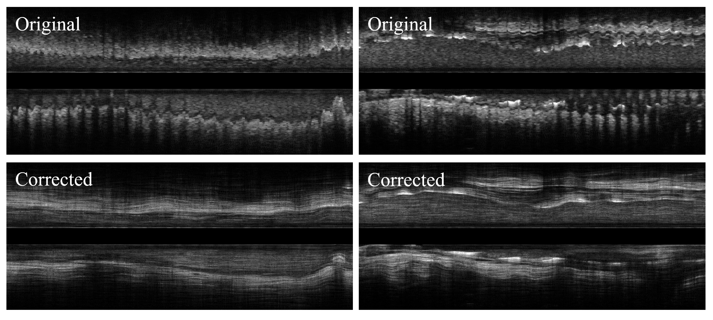
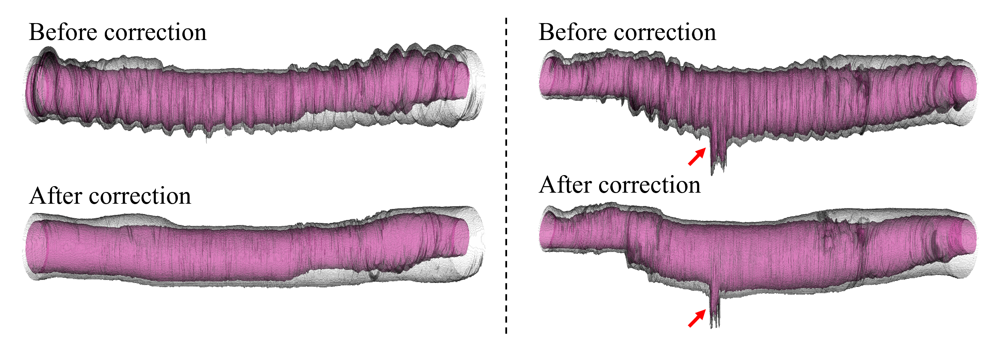

# IVUS_MotionCorrection
Correction of Cardiac Motion Artifacts in Intravascular Ultrasound

> ⚠️ **Note:** The **Full code** will be released **after the paper is accepted**.
>
>  Thank you for your patience and interest!
>
## Introduction

Intravascular ultrasound (IVUS) is prone to cardiac motion artifacts that cause sawtooth deformations, affecting vessel and plaque assessment. We propose a correction method for IVUS cardiac motion artifacts.

## Performance

Longitudinal view before and after correction.

Sequence video before and after correction.

Three-dimensional reconstruction of membrane segmentations before and after correction. (The protrusion indicated by the red arrow corresponds to a side branch.)

